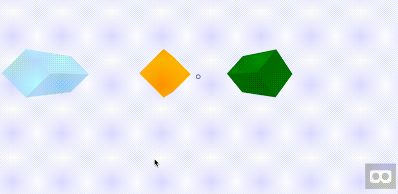

# Stereo-Sky A-Frame Component 
An alternative to `<a-sky>`, but uses stereo cube-map textures (ie. left and right eye textures) 

Presented at Autodesk [Forge conference](http://forge.autodesk.com/).
 

### Tutorial links:

- DEMO: [final.html](http://cardboard.autodesk.com/aframe/final.html)

video showing that a-frame works on gearVR browser: [mp4](https://raw.githubusercontent.com/wallabyway/aframe-stereocube/master/autodesk-pano.mp4)

Intermediate Steps:

- interm1: [interm1.html](http://cardboard.autodesk.com/aframe/interm1.html)
- interm2: [interm2.html](http://cardboard.autodesk.com/aframe/interm2.html)
- interm3: [interm3.html](http://cardboard.autodesk.com/aframe/interm3.html)
- interm4: [interm4.html](http://cardboard.autodesk.com/aframe/interm4.html)

Using images from [Autodesk A360 Gallery, Project: brooke-and-lauren-model](https://gallery.autodesk.com/a360rendering/projects/44243/brooke-and-lauren-model)

### Slides
[google docs](https://docs.google.com/presentation/d/1Mmb74lq3e8XI8BqfiOvzPpjZgy6IVfmvcqnFlVCnHjs/edit?usp=sharing)

## Usage:
Add stereocube.js ...
>` < script src="stereocube.js" > `

Then, attach the component to an entity using the path to the folder holding your cubemap as the attribute.
Add two, one for the left eye, one for the right and set the eye property too, like this...

    <a-entity skycube="folder:brooke1L; eye:left" scale="1 1 -1"></a-entity>
    <a-entity skycube="folder:brooke1R; eye:right" scale="1 1 -1"></a-entity>

Note: the scale property was added here, instead of as a modification to the matrix, to avoid raycast issue with the skybox.

Inside the folder, the component assumes the following naming scheme:
> var urls = [
    'L-0.jpg',
    'L-1.jpg',
    'L-2.jpg',
    'L-3.jpg',
    'L-4.jpg',
    'L-5.jpg' ];  
     ie. front, right, back, left, floor, ceiling

This is the scheme used by Three.js's [CubeTexture](http://threejs.org/docs/index.html#Reference/Textures/CubeTexture). If your cubemap images do not follow this scheme, you will need to rename them (or fork this repo and alter the above in stereocube.js).

Finally, add the 'stereocam' property to your camera, like this:

` <a-camera stereocam position="0 0 0">  </a-camera>
`

---

## Referenced

- stereo-material: [github](https://github.com/oscarmarinmiro/aframe-stereo-component)
- href camera: [github](https://github.com/gasolin/aframe-href-component/blob/master/index.js)
- cubemap: [git](https://rawgit.com/bryik/aframe-cubemap-component/master/dist/aframe-cubemap-component.js)
- 360boilerplate: [github](https://github.com/aframevr/360-image-viewer-boilerplate)

## Notes
### Blogs
- A-Frame Blog: [A Week of A-Frame 14](https://aframe.io/blog/awoa-14/)
- Facebook f8 conference: [Under the hood: Building 360 video](https://code.facebook.com/posts/1638767863078802/under-the-hood-building-360-video/)
- Reddit: [webVR](https://www.reddit.com/r/WebVR/?count=75&after=t3_49i31t)
- Forward Web Summit, Youtube: [Build the Virtual Reality Web with A-Frame](https://www.youtube.com/watch?v=f2pu-oMspLs)
- Tutorial : [build a simple webVR UI with a-frame](https://blog.neondaylight.com/build-a-simple-web-vr-ui-with-a-frame-a17a2d5b484#.lop1nfiy3)
- Why A-Frame (vs 3dml etc): [ngokevin's blog](http://ngokevin.com/blog/aframe-vs-3dml/)

### Other a-frame walkthrough's
- [vrviewer](http://vrviewer.istaging.co/#!/684173)
- [eyehouse](http://www.eyehouse.co/live/eye_objects/eo415279883198#)
- [domain.com.au](http://domain-vr.herokuapp.com/)

### Random

- I'd prefer to use cubetextureLoader, but ran into issues with caching (??): [github](https://github.com/aframevr/aframe/commit/69cf2fa32da5f7bf7e55641937a27fac6dfe8d2b)
- aframe's coordinate system: [aframe-demo](http://www.wsundine.com/a-frame/positioning)
- material based cubemap: [PhaseOne](https://github.com/aframevr/aframe/pull/1515/commits/02e58a5ecf11e5216b4fc3ddc2de2bc7d7abbd7b)

